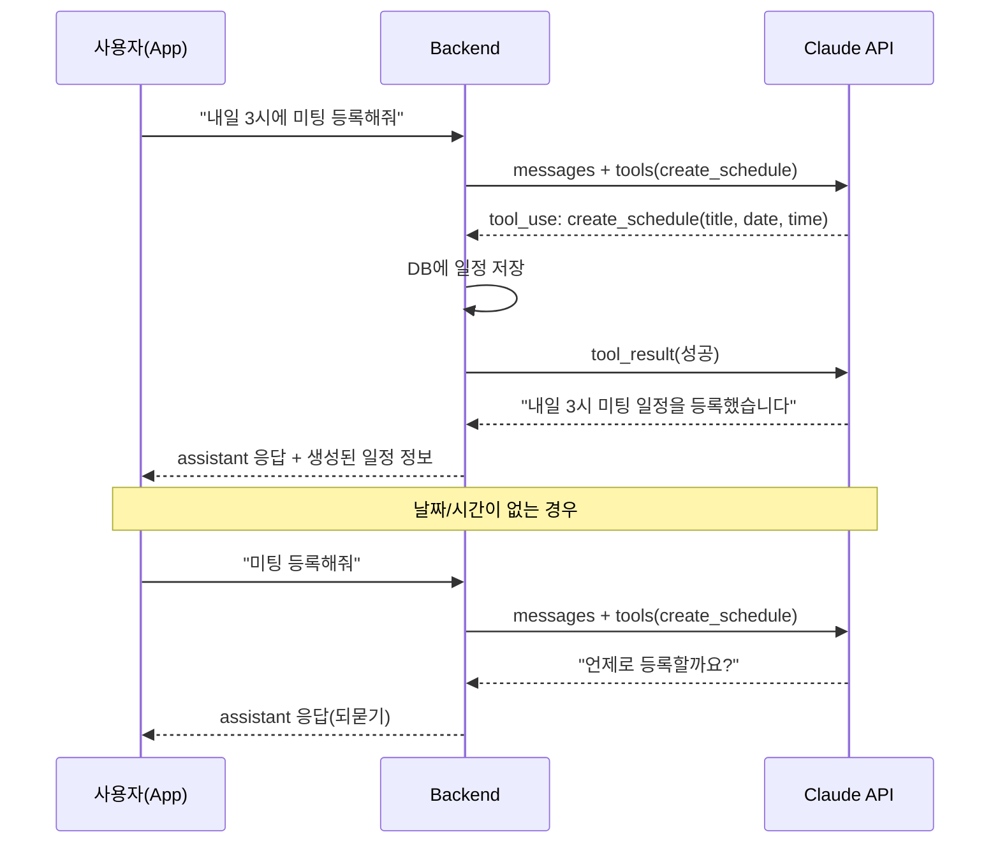

# AI 명령을 이용하여 스케줄 등록

## 개요

채팅 중 AI가 일정 등록 의도를 감지하면 Claude tool_use(Function Calling)로 일정을 자동 생성하고,
정보가 부족하면 되묻는 기능을 구현합니다.

---

## 전체 흐름



---

## 일정 등록 규칙

| 사용자 메시지 예시 | AI 동작 |
|---|---|
| "내일 3시에 미팅 등록해줘" | `create_schedule(title="미팅", date="2026-04-06", startTime="15:00")` 호출 → 등록 |
| "4월 10일에 출장 등록" | `create_schedule(title="출장", date="2026-04-10")` 호출 → **종일 일정**으로 등록 |
| "미팅 등록해줘" | "언제로 등록할까요?" 되묻기 |
| "제주도 여행 계획 세워줘" | 일반 대화 응답 (등록 아님) |

**감지 키워드**: "등록", "추가", "잡아줘", "넣어줘" 등

---

## 1. Backend: Schedule 엔티티 + CRUD API

### 1-1. Schedule 엔티티

**파일**: `src/schedule/schedule.entity.ts`

```typescript
@Entity('schedule')
export class Schedule {
  @PrimaryGeneratedColumn()
  id: number;

  @Column()
  userId: number;

  @ManyToOne(() => User, { onDelete: 'CASCADE' })
  @JoinColumn({ name: 'userId' })
  user: User;

  @Column({ type: 'varchar', length: 200 })
  title: string;

  @Column({ type: 'text', nullable: true })
  description: string | null;

  @Column({ type: 'date' })
  date: string;                    // YYYY-MM-DD

  @Column({ type: 'varchar', length: 5, nullable: true })
  startTime: string | null;        // HH:mm (null이면 종일)

  @Column({ type: 'varchar', length: 5, nullable: true })
  endTime: string | null;          // HH:mm

  @Column({ type: 'boolean', default: true })
  isAllDay: boolean;

  @CreateDateColumn({ type: 'datetime' })
  createdAt: Date;
}
```

### 1-2. ScheduleService

**파일**: `src/schedule/schedule.service.ts`

| 메서드 | 설명 |
|---|---|
| `create(userId, dto)` | 일정 생성. startTime이 없으면 isAllDay=true |
| `findByUser(userId, from?, to?)` | 기간별 조회 |
| `findOne(id, userId)` | 단건 조회 |
| `update(id, userId, dto)` | 수정 |
| `remove(id, userId)` | 삭제 |

### 1-3. ScheduleController

**파일**: `src/schedule/schedule.controller.ts`

| Method | Path | 설명 |
|---|---|---|
| POST | `/schedule` | 일정 생성 |
| GET | `/schedule?from=&to=` | 목록 조회 |
| PATCH | `/schedule/:id` | 수정 |
| DELETE | `/schedule/:id` | 삭제 |

### 1-4. 수정 필요 파일

- `src/schedule/schedule.module.ts` — 엔티티, 서비스, 컨트롤러 등록 + export ScheduleService
- `src/app.module.ts` — ScheduleModule import 추가

---

## 2. Backend: Claude tool_use 연동

### 2-1. Tool 정의

`src/ai/ai-provider.service.ts`의 `callClaude()` 메서드에 tools 파라미터 추가:

```typescript
tools: [{
  name: 'create_schedule',
  description: '사용자의 일정을 등록합니다. 날짜와 제목이 명확할 때만 호출하세요.',
  input_schema: {
    type: 'object',
    properties: {
      title:       { type: 'string', description: '일정 제목' },
      date:        { type: 'string', description: 'YYYY-MM-DD 형식 날짜' },
      startTime:   { type: 'string', description: 'HH:mm 형식 시작 시간 (없으면 종일)' },
      endTime:     { type: 'string', description: 'HH:mm 형식 종료 시간 (선택)' },
      description: { type: 'string', description: '메모 (선택)' },
    },
    required: ['title', 'date'],
  },
}]
```

### 2-2. Tool 실행 흐름

Claude 응답의 `stop_reason`이 `tool_use`인 경우:

1. 응답에서 `tool_use` 블록 추출 (name, id, input)
2. `ScheduleService.create()`로 일정 저장
3. `tool_result` 메시지를 구성하여 Claude에 다시 요청
4. Claude가 자연어 확인 응답 생성 ("일정이 등록되었습니다")

```typescript
// Claude 응답 처리 (의사 코드)
if (response.stop_reason === 'tool_use') {
  const toolBlock = response.content.find(b => b.type === 'tool_use');
  const schedule = await scheduleService.create(userId, toolBlock.input);

  // tool_result를 포함하여 Claude에 재요청
  messages.push({ role: 'assistant', content: response.content });
  messages.push({
    role: 'user',
    content: [{
      type: 'tool_result',
      tool_use_id: toolBlock.id,
      content: JSON.stringify({ success: true, scheduleId: schedule.id }),
    }]
  });

  const finalResponse = await callClaude(messages);
  return { text: finalResponse.text, scheduleCreated: schedule };
}
```

### 2-3. chat.service.ts 수정

- `AiProviderService.chat()` 반환값에 `scheduleCreated` 정보 포함
- 응답 DTO(`SendChatMessageResponseDto`)에 `schedule` 필드 추가 (nullable)
- 앱에서 일정 생성 여부를 UI로 표시 가능

---

## 3. 시스템 프롬프트 보강

기존 페르소나 시스템 프롬프트 뒤에 일정 관련 지침을 동적으로 추가:

```
[일정 관리 도구]
사용자가 일정 등록을 요청하면 create_schedule 도구를 사용하세요.
- "등록", "추가", "잡아줘", "넣어줘" 등의 표현이 일정 등록 의도입니다.
- 날짜만 있고 시간이 없으면 startTime 없이 호출하세요 (종일 일정).
- 날짜가 불분명하면 먼저 날짜/시간을 질문하세요.
- "내일", "다음 주 월요일" 등은 오늘 날짜 기준으로 계산하세요.
- 오늘 날짜: {today}
```

`{today}`는 `chat.service.ts`에서 `new Date().toISOString().slice(0, 10)` 으로 동적 치환.

---

## 4. App: 캘린더 화면에서 일정 표시

### 4-1. schedule_service.dart

**파일**: `lib/services/schedule_service.dart`

일정 CRUD API 클라이언트 (JWT 인증 포함):
- `fetchSchedules(from, to)` → `GET /schedule?from=&to=`
- `createSchedule(dto)` → `POST /schedule`
- `updateSchedule(id, dto)` → `PATCH /schedule/:id`
- `deleteSchedule(id)` → `DELETE /schedule/:id`

### 4-2. calendar_screen.dart 수정

현재 스텁 상태 → 아래로 교체:
- 상단: 월별 달력 위젯 (일정이 있는 날짜에 점 표시)
- 하단: 선택한 날짜의 일정 리스트
- 일정 탭 시 상세 보기 / 수정 / 삭제

### 4-3. chat_test.dart 수정

AI 응답에 `schedule` 정보가 포함되면:
- SnackBar로 "일정이 등록되었습니다" 표시
- 또는 채팅 내 인라인 카드로 등록된 일정 요약 표시

---

## 핵심 포인트

- **OpenAI 확장**: OpenAI도 function calling을 지원하므로, `callOpenAI()`에도 동일한 tools 구조 추가 가능 (파라미터명만 `functions` → `tools`로 차이)
- **Gemini**: Gemini는 tool calling 방식이 다르므로 별도 처리 필요
- **날짜 계산**: 시스템 프롬프트에 오늘 날짜를 동적으로 주입하여 "내일", "다음 주" 등을 AI가 정확히 계산
- **DB 초기화 불필요**: 기존 `db.sqlite`에 `synchronize: true`로 새 schedule 테이블 자동 생성

---

## 작업 목록

- [ ] Backend: Schedule 엔티티 + ScheduleService CRUD + ScheduleController + DTO 생성
- [ ] Backend: Claude tool_use 연동 (ai-provider.service.ts callClaude 수정)
- [ ] Backend: chat.service.ts에서 tool_use 결과 처리 + 일정 저장 로직
- [ ] Backend: 시스템 프롬프트에 일정 등록 지침 + 오늘 날짜 주입
- [ ] App: schedule_service.dart API 클라이언트 생성
- [ ] App: calendar_screen.dart 달력 + 일정 목록 UI 구현
- [ ] App: 채팅에서 일정 생성 시 UI 피드백 표시
